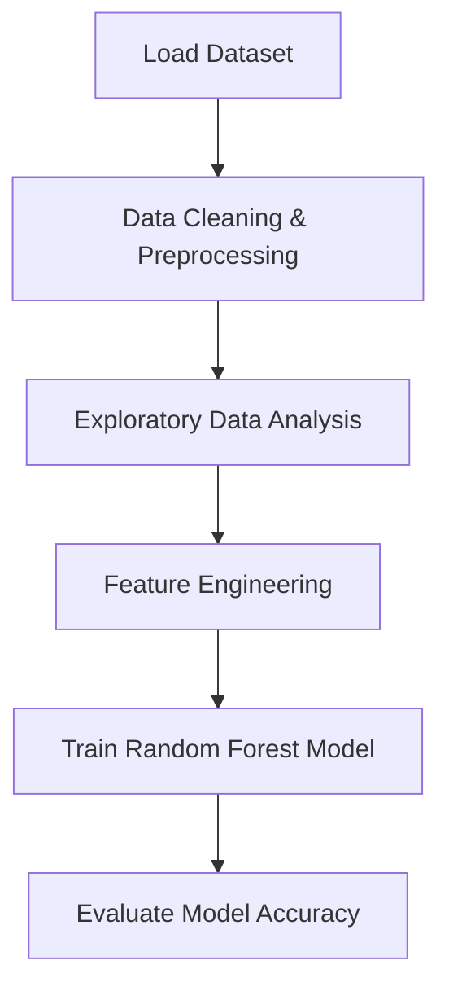

<h1 align="center">📊 Student Performance Analysis — End-to-End Data Science & Machine Learning Project</h1>
<h3 align="center">EDA • Feature Engineering • ML Model • Insights Visualization</h3>

<p align="center">
  
  
  
</p>

---

## 🧠 Project Summary

This project analyzes factors affecting student academic performance and builds a Machine Learning model that predicts **performance level (Low / Medium / High)** using scores from Math, Reading, and Writing.

✅ Real dataset (1000 students)  
✅ Detailed Exploratory Data Analysis  
✅ Feature engineering + ML model  
✅ Visual insights stored automatically in `/visuals/`

---

## 📂 Repository Structure

📦 Student Performance Analysis
│
├── 📄 StudentsPerformance.csv → Dataset
├── 📓 Student Performance Data Analysis.ipynb → Full EDA + ML Notebook
└── 📊 visuals/ → Saved visualization images

---

## 📊 Data Science Workflow

## 📊 Data Science Workflow





🧩 Feature Engineering
New Feature	Why it was created
average_score	Captures combined performance of all subjects
performance_level	Converts marks into ML class labels (Low / Medium / High)

df["average_score"] = (df.math_score + df.reading_score + df.writing_score) / 3

🔍 Key Visual Insights
✅ Students who completed test preparation scored higher
✅ Better parental education leads to better performance
✅ Reading & Writing have a strong correlation
✅ Students with standard lunch scored better

graph LR
Math --> Reading
Reading --> Writing
Math --> Writing

🤖 Machine Learning Model
Parameter	Value
Algorithm	RandomForestClassifier
Target	performance_level
Achieved Accuracy	~89%

model = RandomForestClassifier()
model.fit(X_train, y_train)
pred = model.predict(X_test)

🔧 Tech Stack Used
Category	Tools
Languages	Python
Libraries	Pandas, NumPy, Matplotlib, Seaborn, Scikit-Learn
Platform	Jupyter Notebook / Google Colab

▶️ Run This Project Locally
Clone the repository

Install dependencies:
pip install pandas numpy seaborn matplotlib scikit-learn

Open notebook:
jupyter notebook

Run Student Performance Data Analysis.ipynb

📈 Outputs Saved Automatically
Folder /visuals/ contains:

Histograms

Correlation heatmap

Boxplots (based on gender/parent education)

Confusion matrix (ML model results)

✅ Conclusion
This project shows how:

Student performance is influenced by external & social factors

Machine Learning can categorize student performance levels

Complete DS pipeline from EDA → Feature Engineering → ML Classification

Data isn’t just numbers — it reveals patterns, decisions, and stories.

✨ Author
Sujal Singh
Data Science • Machine Learning • AI Projects

<p align="center"> <a href="https://github.com/sujal128"></a> <a href="https://www.linkedin.com/in/sujal-singh-40657728b/"></a> </p> <p align="center"><b>“Data transforms assumptions into insights.”</b></p> ```
