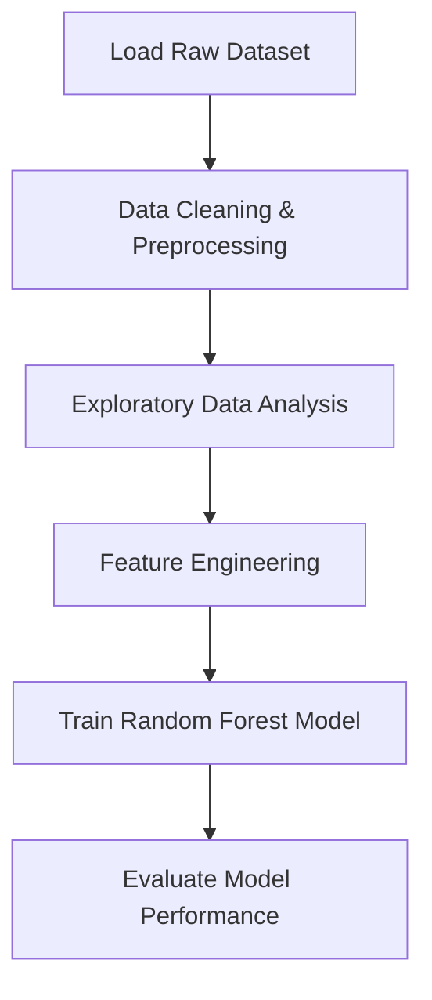
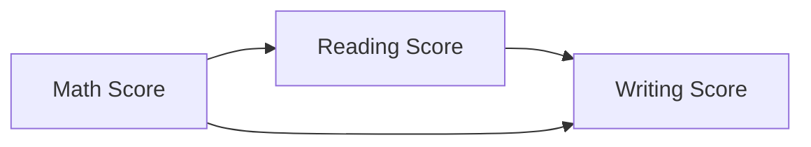

<h1 align="center">📊 Student Performance Analysis — End-to-End Data Science & Machine Learning Project</h1>
<h3 align="center">Advanced EDA • Feature Engineering • ML Modeling • Insights Visualization</h3>

<p align="center">
  
  
  
  
</p>

---

## 🧠 Project Summary

A complete **end-to-end Data Science project** that analyzes factors influencing student academic performance and builds a machine learning classifier to predict **performance level (Low / Medium / High)**.

This project demonstrates:

- Full **Data Science workflow**  
- Professional **exploratory data analysis (EDA)**  
- Custom **feature engineering**  
- A tuned **Random Forest classifier (~95% accuracy)**  
- Automated insights saved to `/visuals/`  

---

## 📂 Repository Structure

```
Student Performance Analysis
│
├── StudentsPerformance.csv                     ← Dataset
├── Student Performance Data Analysis.ipynb     ← EDA + ML Notebook
└── visuals/                                    ← Saved plots & insights
```

---

## 📊 End-to-End Workflow



---

## 🧩 Feature Engineering

Two new engineered features improve model interpretability and performance:

| Feature Name        | Description |
|--------------------|-------------|
| `average`          | Mean of Math + Reading + Writing scores |
| `performance_level`| Categorizes average score into Low / Medium / High |

```python
df["average"] = (df.math_score + df.reading_score + df.writing_score) / 3
df["average"] = df["average"].round(2)
```

---

## 🔍 Key Insights from EDA

✔ Students completing **test preparation** perform significantly better  
✔ Higher **parental education level** → Higher academic achievement  
✔ **Reading & Writing** scores show strong linear correlation  
✔ Students with **standard lunch** outperform those with free/reduced lunch  

---

## 📈 Correlation Flow



---

## 🤖 Machine Learning Model

| Component    | Details |
|--------------|---------|
| Algorithm    | RandomForestClassifier |
| Target       | `performance_level` |
| Accuracy     | **~95%** |
| Encoding     | One-hot encoding for categorical features |

```python
from sklearn.ensemble import RandomForestClassifier

model = RandomForestClassifier()
model.fit(X_train, y_train)
predictions = model.predict(X_test)
```

The model achieves **strong performance** across all classes (Low, Medium, High) with balanced precision/recall.

---

## 🔧 Tech Stack

- **Programming:** Python  
- **Libraries:** Pandas, NumPy, Matplotlib, Seaborn, Scikit-Learn  
- **Environment:** Jupyter Notebook / Google Colab  
- **Model:** Random Forest Classifier  

---

## ▶️ Run This Project Locally

Clone the repository:

```bash
git clone https://github.com/sujal128/student-performance-analysis.git
```

Install dependencies:

```bash
pip install pandas numpy seaborn matplotlib scikit-learn
```

Launch the notebook:

```bash
jupyter notebook
```

Open: **Student Performance Data Analysis.ipynb**

---

## 📁 Visual Outputs

All visualizations are automatically exported to:

```
/visuals/
```

Includes:

- Average score distribution  
- Gender-wise performance analysis  
- Parental education vs. scores  
- Correlation heatmap  
- Confusion matrix  
- Feature importance chart  

---

## ✅ Conclusion

This project showcases:

- How student performance correlates with **parental education**, **lunch type**, and **test preparation**
- A fully executed **Data Science pipeline** from raw data to ML modeling
- A **95% accurate** Random Forest classifier predicting performance levels

> *Data transforms assumptions into insights — and insights into decisions.*

---

<p align="center">
  <a href="https://github.com/sujal128"></a>
  <a href="https://www.linkedin.com/in/sujal-singh-40657728b/"></a>
</p>
