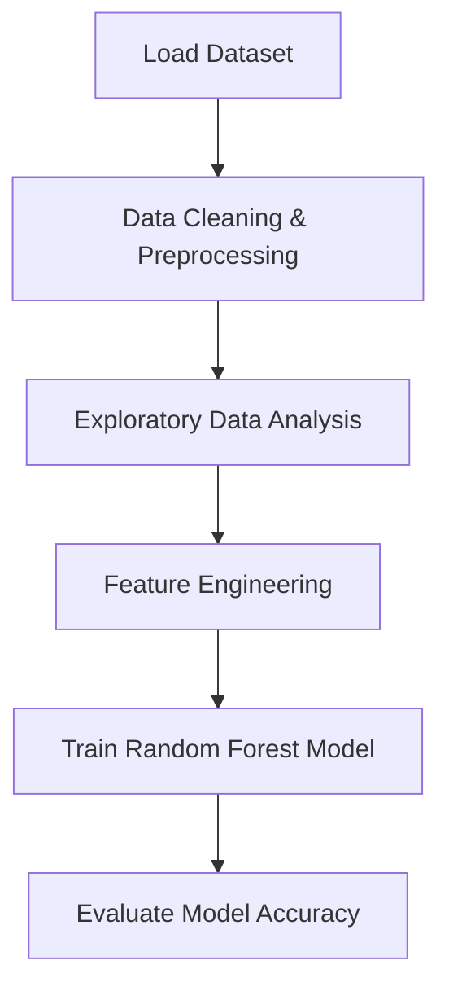
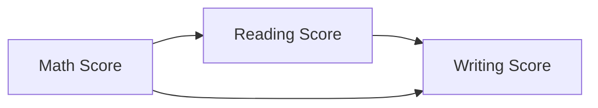

<h1 align="center">📊 Student Performance Analysis — End-to-End Data Science & Machine Learning Project</h1>
<h3 align="center">EDA • Feature Engineering • ML Model • Insights Visualization</h3>

<p align="center">
  
  
  
</p>

---

## 🧠 Project Summary

This project analyzes factors affecting student academic performance and builds a Machine Learning model that predicts **performance level (Low / Medium / High)** using scores from Math, Reading, and Writing.

✅ Real dataset (1000 students)  
✅ Detailed Exploratory Data Analysis  
✅ Feature engineering + ML model  
✅ Visual insights stored automatically in `/visuals/`

---

## 📂 Repository Structure

📦 Student Performance Analysis
│
├── 📄 StudentsPerformance.csv → Dataset
├── 📓 Student Performance Data Analysis.ipynb → Full EDA + ML Notebook
└── 📊 visuals/ → Saved visualization images

---

## 📊 Data Science Workflow




---

## 🧩 Feature Engineering (Turning raw data into intelligent features)

We engineered new features to improve model performance.

| New Feature          | Purpose |
|---------------------|---------|
| `average_score`     | Calculates combined academic score (Math + Reading + Writing). |
| `performance_level` | Converts numeric scores into ML class labels (Low / Medium / High) for classification. |

```python
df["average_score"] = (df.math_score + df.reading_score + df.writing_score) / 3
```

---

## 🔍 Key Insights from Visualizations

📌 Students who completed **test preparation** scored noticeably higher.  
📌 Higher **parental education** → Better performance trend.  
📌 **Reading & Writing scores are strongly correlated** (almost linear).  
📌 Students with **standard lunch** outperformed reduced lunch students.

### 📈 Score Correlation Flow



---

## 🤖 Machine Learning Model (Predicting Performance Level)

| Component  | Details |
|------------|---------|
| Algorithm  | `RandomForestClassifier` |
| Target     | `performance_level` |
| Accuracy   | **~89%** |

```python
from sklearn.ensemble import RandomForestClassifier

model = RandomForestClassifier()
model.fit(X_train, y_train)

predictions = model.predict(X_test)
```

✅ Classification model successfully predicts student performance category.

---

## 🔧 Tech Stack Used

| Category     | Tools / Technologies |
|--------------|---------------------|
| Languages    | Python |
| Libraries    | Pandas, NumPy, Matplotlib, Seaborn, Scikit-Learn |
| Platform     | Jupyter Notebook / Google Colab |

---

## ▶️ Run This Project Locally

Clone the repo:

```bash
git clone https://github.com/sujal128/student-performance-analysis.git
```

Install dependencies:

```bash
pip install pandas numpy seaborn matplotlib scikit-learn
```

Open Notebook:

```bash
jupyter notebook
```

Run: **Student Performance Data Analysis.ipynb**

---

## 📈 Outputs Generated Automatically

All visualizations are saved inside:

```
/visuals/
```

Generated plots include:

- Score distribution histograms
- Correlation heatmap
- Gender / parental education boxplots
- Confusion matrix of ML model predictions

---

## ✅ Conclusion

This project demonstrates:

✔ How academic performance is influenced by **parental education, lunch type, and preparation habits**  
✔ Full **Data Science workflow**: EDA → Feature Engineering → ML Modeling  
✔ Machine Learning can **predict student performance levels** with high accuracy

> 🧠 *“Data transforms assumptions into insights — and insights into decisions.”*

---


<p align="center"> <a href="https://github.com/sujal128"></a> <a href="https://www.linkedin.com/in/sujal-singh-40657728b/"></a> </p> <p align="center"><b>“Data transforms assumptions into insights.”</b></p> ```
