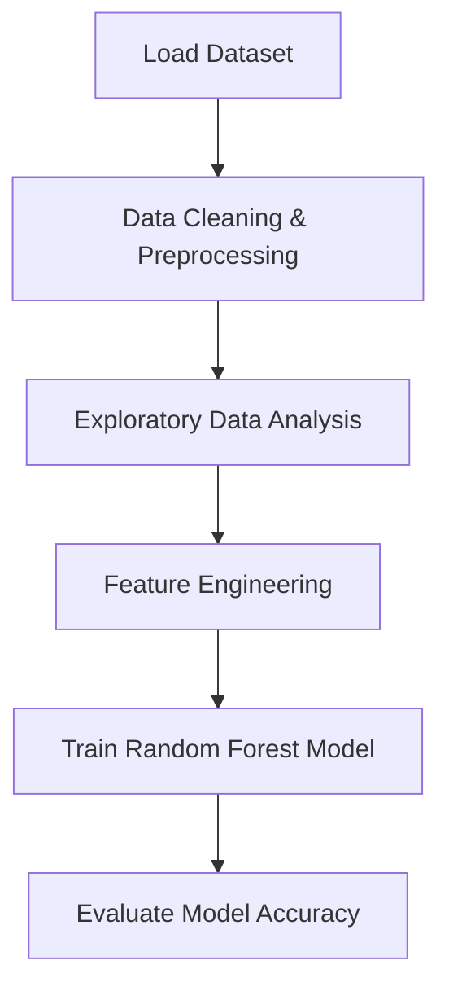

# 📊 Student Performance Analysis — End-to-End Data Science & Machine Learning Project
### EDA • Feature Engineering • ML Model • Insights Visualization

---

## 🧠 Project Summary

This project analyzes factors affecting student academic performance and builds a Machine Learning model that predicts **performance level (Low / Medium / High)** using scores from Math, Reading, and Writing.

- Real dataset (1000 students)  
- Detailed Exploratory Data Analysis  
- Feature engineering + ML model  
- Visual insights saved automatically in `/visuals/`

---

## 📂 Repository Structure

```
Student Performance Analysis
│
├── StudentsPerformance.csv                 → Dataset
├── Student Performance Data Analysis.ipynb → Full EDA + ML Notebook
└── visuals/                                → Saved visualization images
```

---

## 📊 Data Science Workflow



---

## 🧩 Feature Engineering

| Feature            | Purpose |
|--------------------|---------|
| `average`          | Combined academic score (Math + Reading + Writing) |
| `performance_level`| Converts average score into classes (Low/Medium/High) |

```python
df["average"] = (df.math_score + df.reading_score + df.writing_score) / 3
```

---

## 🔍 Key Insights

- Students who completed **test preparation** scored higher  
- Higher **parental education** → Better performance  
- **Reading & Writing** scores are strongly correlated  
- Students with **standard lunch** performed better  

---

## 🤖 Machine Learning Model

| Component  | Details |
|------------|---------|
| Algorithm  | RandomForestClassifier |
| Target     | performance_level |
| Accuracy   | **~95%** |

```python
model = RandomForestClassifier()
model.fit(X_train, y_train)
predictions = model.predict(X_test)
```

---

## 🔧 Tech Stack

- Python  
- Pandas, NumPy  
- Matplotlib, Seaborn  
- Scikit-Learn  
- Jupyter Notebook / Google Colab

---

## ▶️ Run This Project Locally

Clone the repo:

```bash
git clone https://github.com/sujal128/student-performance-analysis.git
```

Install dependencies:

```bash
pip install pandas numpy seaborn matplotlib scikit-learn
```

Run the notebook:

```bash
jupyter notebook
```

Open: **Student Performance Data Analysis.ipynb**

---

## 📈 Outputs Saved Automatically

All plots are saved in:

```
/visuals/
```

Includes:

- Score distribution  
- Parental education boxplot  
- Correlation heatmap  
- Gender-wise averages  
- Confusion matrix  
- Feature importance chart  

---

## ✅ Conclusion

This project shows:

- How performance is influenced by **parental education**, **lunch type**, and **test preparation**
- Full Data Science pipeline: EDA → Feature Engineering → Modeling
- ML model predicts student performance categories with **~95% accuracy**

> *“Data transforms assumptions into insights — and insights into decisions.”*

---

### GitHub: https://github.com/sujal128  
### LinkedIn: https://www.linkedin.com/in/sujal-singh-40657728b/
